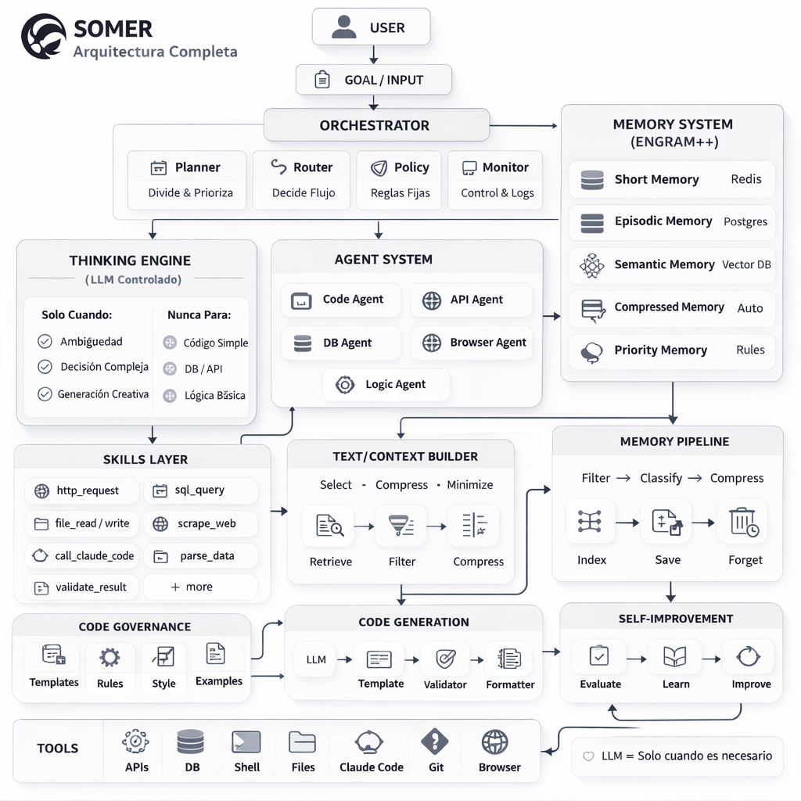

# SOMER Architecture Overview

## System Diagram



---

## Core Principle

```
LLM = last resort
Code = first solution
```

SOMER is designed to minimize LLM token usage by preferring deterministic code execution over probabilistic reasoning.

---

## Component Overview

### 1. ORCHESTRATOR (Brain)

The central coordinator that manages all execution flow.

```
┌─────────────────────────────────────────────┐
│                ORCHESTRATOR                  │
├──────────┬──────────┬──────────┬────────────┤
│ Planner  │  Router  │  Policy  │  Monitor   │
│ Divide & │  Decide  │  Regime  │  Control   │
│ Prioritize│  Next   │  Type    │  & Log     │
└──────────┴──────────┴──────────┴────────────┘
```

**Responsibilities:**
- Receive structured input
- Route to appropriate handler based on mode
- Enforce policies
- Monitor execution

**Location:** `somer/core/orchestrator/`

---

### 2. MEMORY SYSTEM (ENGRAM++)

Multi-tier memory system with intelligent compression.

```
┌─────────────────────────────────────────────┐
│              MEMORY SYSTEM                   │
├─────────────────────────────────────────────┤
│  Short Memory    │  Episodic Memory         │
│  (Redis)         │  (Forgettable)           │
├──────────────────┼──────────────────────────┤
│  Semantic Memory │  Procedural Memory       │
│  (For Life)      │  (How-To)                │
├──────────────────┼──────────────────────────┤
│  Compressed      │  Priority Memory         │
│  Memory          │  (Recent)                │
├─────────────────────────────────────────────┤
│           MEMORY PIPELINE                    │
│  Canvas → Compress → Store → Query → Forget │
└─────────────────────────────────────────────┘
```

**Memory Types:**

| Type | Storage | TTL | Purpose |
|------|---------|-----|---------|
| Short | Redis | 1h | Current session context |
| Episodic | SQLite | Variable | Task-specific memories |
| Semantic | Vector DB | Permanent | Core knowledge |
| Procedural | SQLite | Permanent | How-to patterns |
| Compressed | SQLite | Long | Archived memories |
| Priority | Redis | 24h | Recent important items |

**Location:** `somer/memory/`

---

### 3. THINKING ENGINE

LLM wrapper with safety constraints.

```
┌─────────────────────────────────────────────┐
│            THINKING ENGINE                   │
│           (LLM Constrained)                  │
├─────────────────────────────────────────────┤
│  Safe Prompt   │  Safety constraints        │
│  Decision      │  Complex logic routing     │
│  Safe Mode     │  Fallback handling         │
│  Reasoning     │  Structured output         │
└─────────────────────────────────────────────┘
```

**Key Features:**
- Low temperature (0.1) for deterministic output
- Strict output format enforcement
- No hallucinated dependencies
- Rule-based validation

**Location:** `somer/tools/llm/`

---

### 4. AGENT SYSTEM

Specialized execution agents.

```
┌─────────────────────────────────────────────┐
│              AGENT SYSTEM                    │
├──────────────┬──────────────┬───────────────┤
│  Code Agent  │  API Agent   │  QA Agent     │
│  Generate    │  HTTP calls  │  Validation   │
├──────────────┼──────────────┼───────────────┤
│  Browser     │  Logic Agent │  Eval Agent   │
│  Automation  │  Reasoning   │  Analysis     │
└──────────────┴──────────────┴───────────────┘
```

**Agent Routing:**
1. Orchestrator receives task
2. Router determines best agent
3. Agent executes with context
4. Result returns to orchestrator

**Location:** `somer/agents/`

---

### 5. SKILLS LAYER

Deterministic tools that don't require LLM.

```
┌─────────────────────────────────────────────┐
│              SKILLS LAYER                    │
├──────────┬──────────┬──────────┬────────────┤
│   File   │    DB    │   HTTP   │    Git     │
│  read    │  query   │  client  │   ops      │
│  write   │  insert  │  fetch   │   log      │
├──────────┼──────────┼──────────┼────────────┤
│   Code   │  Parsing │  Math    │ Validation │
│  execute │  extract │  compute │   check    │
└──────────┴──────────┴──────────┴────────────┘
```

**Skill Priority:**
1. File skills
2. DB skills
3. HTTP skills
4. Code skills
5. Git skills
6. Math skills
7. LLM (fallback)

**Location:** `somer/skills/`

---

### 6. CODE ENGINE

Template-based code generation with strict rules.

```
┌─────────────────────────────────────────────┐
│              CODE ENGINE                     │
├─────────────────────────────────────────────┤
│  Generator      │  Rules enforcement        │
│  Templates      │  Style validation         │
│  Formatter      │  Library whitelist        │
├─────────────────────────────────────────────┤
│              VALIDATOR                       │
│  Lint  │  Test  │  Security  │  Coverage   │
└─────────────────────────────────────────────┘
```

**Hard Rules:**
1. ALWAYS follow template structure
2. ALWAYS use consistent naming
3. NO unnecessary abstractions
4. NO duplicated logic
5. ALWAYS include error handling
6. NO hallucinated libraries

**Location:** `somer/engine/code_engine/`

---

### 7. CONTEXT BUILDER

Token minimization and relevance selection.

```
┌─────────────────────────────────────────────┐
│           TEXT/CONTEXT BUILDER               │
├──────────────┬──────────────┬───────────────┤
│   Select     │   Compress   │   Minimize    │
│   Relevant   │   Remove     │   Tokens      │
│   Memory     │   Redundancy │   Output      │
└──────────────┴──────────────┴───────────────┘
```

**Location:** `somer/core/context/`

---

### 8. SELF-REFINEMENT

Autonomous improvement loop.

```
┌─────────────────────────────────────────────┐
│           SELF-REFINEMENT                    │
├──────────────┬──────────────┬───────────────┤
│  Self-Plan   │  Self-Test   │  Self-Correct │
│  Break down  │  Validate    │  Fix issues   │
│  tasks       │  output      │  automatically│
└──────────────┴──────────────┴───────────────┘
```

---

## Execution Flow

```
USER INPUT
    │
    ▼
┌─────────────┐
│ ORCHESTRATOR│
└──────┬──────┘
       │
       ▼
┌─────────────┐     ┌─────────────┐
│   POLICY    │────▶│   REJECT    │
│   CHECK     │ NO  │             │
└──────┬──────┘     └─────────────┘
       │ YES
       ▼
┌─────────────┐
│   ROUTER    │
└──────┬──────┘
       │
       ├────────────────────────────────┐
       │                                │
       ▼                                ▼
┌─────────────┐                  ┌─────────────┐
│   SKILLS    │                  │   AGENTS    │
│ (Preferred) │                  │ (Fallback)  │
└──────┬──────┘                  └──────┬──────┘
       │                                │
       └────────────┬───────────────────┘
                    │
                    ▼
             ┌─────────────┐
             │   MONITOR   │
             └──────┬──────┘
                    │
                    ▼
               OUTPUT JSON
```

---

## Data Flow

### Input Format

```json
{
  "goal": "high-level objective",
  "task": "specific action",
  "context": {
    "memory": [],
    "constraints": [],
    "environment": {}
  },
  "mode": "plan | execute | code | analyze"
}
```

### Output Format

```json
{
  "status": "success | error",
  "mode": "...",
  "result": {},
  "next_action": "optional"
}
```

---

## Technology Stack

| Component | Technology |
|-----------|------------|
| Language | Python 3.11+ |
| Async | asyncio |
| Validation | Pydantic |
| Short Memory | Redis |
| Long Memory | SQLite |
| Semantic | Vector DB (future) |
| LLM | Claude API |
| Testing | pytest |

---

## Module Dependencies

```
                    ┌─────────────┐
                    │   CONFIG    │
                    └──────┬──────┘
                           │
              ┌────────────┼────────────┐
              │            │            │
              ▼            ▼            ▼
        ┌─────────┐  ┌─────────┐  ┌─────────┐
        │ MEMORY  │  │ORCHEST. │  │  TOOLS  │
        └────┬────┘  └────┬────┘  └────┬────┘
             │            │            │
             └────────────┼────────────┘
                          │
              ┌───────────┼───────────┐
              │           │           │
              ▼           ▼           ▼
        ┌─────────┐ ┌─────────┐ ┌─────────┐
        │ AGENTS  │ │ SKILLS  │ │ ENGINE  │
        └─────────┘ └─────────┘ └─────────┘
```

---

## Next: Module Documentation

- [Orchestrator](../modules/orchestrator.md)
- [Code Engine](../modules/code-engine.md)
- [Memory System](../modules/memory.md)
